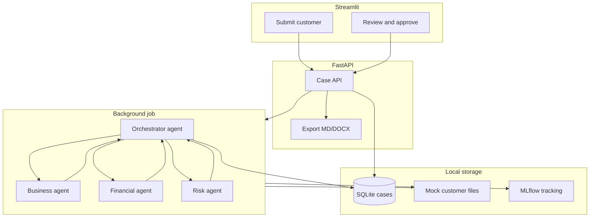

```mermaid
flowchart TB
    subgraph UI [Streamlit]
        Submit[Submit customer]
        Review[Review and approve]
    end

    subgraph API [FastAPI]
        Cases[Case API]
        Export[Export MD/DOCX]
    end

    subgraph Worker [Background job]
        Orch[Orchestrator agent]
        B[Business agent]
        F[Financial agent]
        R[Risk agent]
    end

    subgraph Store [Local storage]
        DB[(SQLite cases)]
        Files[Mock customer files]
        MLF[MLflow tracking]
    end

    Submit --> Cases
    Cases --> DB
    Cases --> Worker
    Worker --> Files
    Orch --> B & F & R
    B & F & R --> Orch
    Orch --> DB
    Worker --> MLF
    Review --> Cases
    Cases --> Export
```