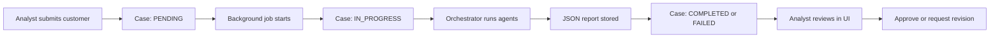

# What to build first

```mermaid
flowchart LR
    A[Analyst submits customer] --> B[Case: PENDING]
    B --> C[Background job starts]
    C --> D[Case: IN_PROGRESS]
    D --> E[Orchestrator runs agents]
    E --> F[JSON report stored]
    F --> G[Case: COMPLETED or FAILED]
    G --> H[Analyst reviews in UI]
    H --> I[Approve or request revision]
```